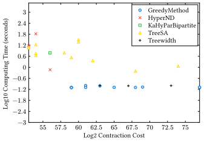

# OMEinsumContractionOrders Benchmark
This repository is for benchmarking the performance of different tensor network contraction order optimizers in [OMEinsumContractionOrders](https://github.com/TensorBFS/OMEinsumContractionOrders.jl).

## Results

The following figure shows the results of the contraction order optimizers on the `examples/quantumcircuit/codes/sycamore_53_20_0.json` instance.


- Version: `OMEinsumContractionOrders@v1.0.0`
- Platform: Ubuntu 24.04 LTS
- Device: Intel(R) Xeon(R) Gold 6226R CPU @ 2.90GHz 

Check the full report: [report.pdf](report.pdf), benchmark results are available in the `examples/*/results` folder.

## Benchmark pipeline

#### 1. Setup environment
```bash
make init  # install all dependencies for all examples
make init-cotengra  # install cotengra dependencies via uv
```

**Prerequisites:** For cotengra benchmarks, you need [`uv`](https://docs.astral.sh/uv/) installed:
```bash
curl -LsSf https://astral.sh/uv/install.sh | sh
```

If you want to benchmark with the developed version of `OMEinsumContractionOrders`, run
```bash
make dev   # develop the master branch of OMEinsumContractionOrders for all examples
```

To switch back to the released version of `OMEinsumContractionOrders`, run
```bash
make free  # switch back to the released version of OMEinsumContractionOrders
```

To update the dependencies of all examples, run
```bash
make update
make update-cotengra  # update all dependencies for cotengra
```

#### 2. Generate tensor network instances
Examples are defined in the [`examples`](examples) folder. To generate contraction codes for all examples, run
```bash
make generate-codes
```
It will generate a file in the `codes` folder of each example, named `*.json`.
These instances are defined in the `main.jl` file of each example.

There is also a script to generate the contraction codes for the [einsumorg](https://github.com/einsumorg/einsumorg) package, run
```bash
make generate-einsumorg-codes
```
It will generate a file in the `codes` folder of the `einsumorg` example, named `*.json`. It requires:
1. Having a working python interpreter in your terminal.
2. Downloading the `instances` dataset from [here](https://zenodo.org/records/11477304) and unpack it in the `examples/einsumorg/instances` folder.

#### 3. Run benchmarks

##### Julia optimizers (OMEinsumContractionOrders.jl)
To run benchmarks with Julia optimizers, run:
```bash
optimizer="Treewidth(alg=MF())" make run
optimizer="Treewidth(alg=MMD())" make run
optimizer="Treewidth(alg=AMF())" make run
optimizer="KaHyParBipartite(; sc_target=25)" make run
optimizer="KaHyParBipartite(; sc_target=25, imbalances=0.0:0.1:0.8)" make run
optimizer="HyperND()" make run
optimizer="HyperND(; dis=METISND(), width=50, imbalances=100:10:800)" make run
optimizer="HyperND(; dis=KaHyParND(), width=50, imbalances=100:10:800)" make run
```

To scan parameters for Julia optimizers:
```bash
for niters in 1 2 4 6 8 10 20 30 40 50; do optimizer="TreeSA(niters=$niters)" make run; done
for niters in {0..10}; do optimizer="GreedyMethod(α=$niters * 0.1)" make run; done
```

##### Cotengra optimizers (Python)
Cotengra is a pure Python implementation managed via `uv`. See [`cotengra/README.md`](cotengra/README.md) for detailed documentation.

**Quick usage:**
```bash
# Basic run (default: 1 trial, minimize='flops')
method=greedy params={} make run-cotengra
method=kahypar params={} make run-cotengra

# With parameters (dict syntax, like Julia)
method=greedy params="{'max_repeats': 10}" make run-cotengra
method=greedy params="{'random_strength': 0.1, 'temperature': 0.5}" make run-cotengra
method=kahypar params="{'parts': 8, 'imbalance': 0.1}" make run-cotengra

# Different optimization objectives
method=greedy params="{'minimize': 'size'}" make run-cotengra    # minimize space
method=greedy params="{'minimize': 'write'}" make run-cotengra   # minimize memory writes
method=greedy params="{'minimize': 'combo'}" make run-cotengra   # combo of flops+write

# Scan parameters
for n in 1 5 10 20 50; do method=greedy params="{'max_repeats': $n}" make run-cotengra; done
for p in 2 4 8 16; do method=kahypar params="{'parts': $p}" make run-cotengra; done
```

**List available methods and hyperparameters:**
```bash
cd cotengra && uv run benchmark.py --list-methods
```

See [`cotengra/README.md`](cotengra/README.md) for:
- Complete list of 9+ optimization methods
- Hyperparameter explanations for each method
- Advanced usage examples
- Installation troubleshooting

If you want to overwrite the existing results, run with argument `overwrite=true`. To remove existing results of all benchmarks, run
```bash
make clean-results
```

#### 4. Generate report
To summarize the results (a necessary step for visualization), run:
```bash
make summary
```
This will generate `summary.json` in the root folder, which contains results from **both** Julia optimizers (OMEinsumContractionOrders) and Python optimizers (cotengra). All cotengra optimizer names are prefixed with `cotengra_` for easy identification.

To visualize the results, [typst](https://typst.app/) >= 0.13 is required. After installing typst just run
```bash
make report
```
It will generate a file named `report.pdf` in the root folder, which contains the report of the benchmarks.
Alternatively, you can use VSCode + `Tinymist typst` extension to directly preview it.

## Contribute more examples
The examples are defined in the [`examples`](examples) folder. To add a new example, you need to:
1. Add a new folder in the [`examples`](examples) folder, named after the problem.
2. Setup a independent environment in the new folder, and add the dependencies in the `Project.toml` file.
3. Add a new `main.jl` file in the new folder, which should contain the following functions:
   - `main(folder::String)`: the main function to generate the contraction codes to the target folder. The sample JSON file is as follows:
    ```json
    {
    "einsum": {
        "ixs": [[1, 2], [2, 3], [3, 4]],
        "iy": []
    },
    "size": {
        "1": 2,
        "2": 2,
        "3": 2,
        "4": 2
    }
    }
    ```
    The `einsum` field is the contraction code with two fields: `ixs` (input labels) and `iy` (output label), and `size` is the size of the tensor indices.
4. Edit the `config.toml` file to add the new example in the `instances` section.
